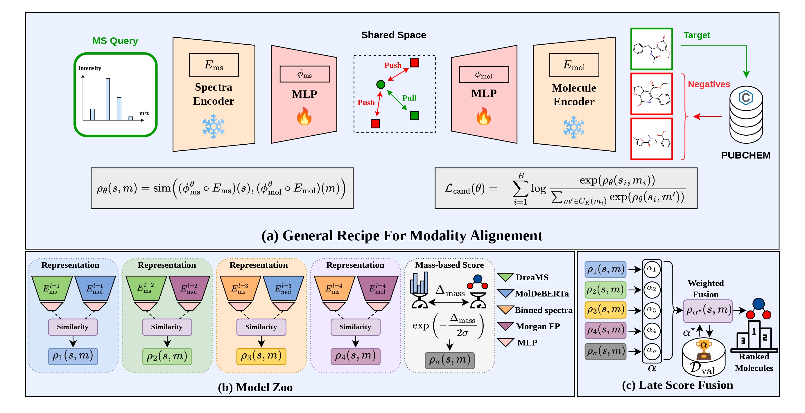

# MSAlign: Aligning Molecule and Mass Spectra representations for Metabolite Identification

[](https://arxiv.org/abs/2605.19752)
[](https://arxiv.org/abs/2605.19752)
[](https://arxiv.org/abs/2605.19752)



**MSAlign** is a model that aligns the latent space of MolDeBERTa and DreaMS and use the similarity in shared space for molecular retrieval.

**MSAlign+** combines 7 different scores (including MSAlign) via late score fusion to further improves the retrieval accuracy. 

## Environment

Python 3.11, `uv`, and a CUDA GPU are recommended.

```bash
git clone https://github.com/KrzakalaPaul/MSAlign.git
cd MSAlign
uv sync
source .venv/bin/activate
```

The default environment contains MSAlign, score fusion, DeepSets, and EmbCos.
It deliberately excludes the two troublesome optional stacks:

- **DreaMS** is needed only to create `dreams.npy`. The preprocessing command
  runs it in an isolated `uv` environment, so its legacy dependency pins do not
  alter `.venv`.
- **DGL** is needed only for the JESTR, FLARE, and MVP baselines. Install it
  with `uv sync --extra graph-baselines`; MSAlign itself never imports DGL.
  The released DGL wheel targets Linux, Python 3.11, and CUDA 12.1.

Raw-data download and MolDeBERTa encoding require the preprocessing extra:

```bash
uv sync --extra preprocessing
source .venv/bin/activate
```

MolDeBERTa is gated. Accept the terms for
`SaeedLab/MolDeBERTa-base-123M-mtr`, then set `HF_TOKEN` before encoding.

For inference directly from a peak list and a SMILES string, see the
[raw-input playground](playground/README.md). It uses a separate environment
containing both frozen foundation models and does not require precomputed
representation files.

## Reproduce MSAlign from scratch

The commands below rebuild the formula-split experiment from raw data. Existing
outputs are reused, so interrupted stages can be rerun safely.

### 1. Download and prepare both datasets

```bash
python download_data.py massspecgym
python download_data.py spectraverse

for seed in 1 2 3; do
  python prepare_data.py massspecgym --split formula --seed "$seed"
  python prepare_data.py spectraverse --split formula --seed "$seed"
done
```

This creates:

- `official_candidates_by_mass` for MassSpecGym;
- `256_candidates_by_mass` for SpectraVerse;
- `formula_seed1`, `formula_seed2`, and `formula_seed3` for both datasets.

The creation of the candidate sets requires multiple CPU cores for fast execution.

Alternatively, skip this preparation step by downloading `massspecgym.zip` and
`spectraverse.zip` from [zenodo](https://zenodo.org/records/22830464), then extract them so that the data
directory has the following layout:

```text
data/
├── massspecgym/
└── spectraverse/
```

### 2. Precompute the four input representations

```bash
export HF_TOKEN=hf_your_token_here

python precompute_representations.py massspecgym \
  --candidate-map official_candidates_by_mass

python precompute_representations.py spectraverse \
  --candidate-map 256_candidates_by_mass
```

This commands require a GPU. Estimated total runtime for a V100 is [TODO: add runtime].
Each command generates DreaMS embeddings, MolDeBERTa embeddings, and packed
Morgan fingerprints. Spectrum bins are computed on demand. DreaMS starts in its
own environment automatically.

After preprocessing, return to the minimal environment if desired:

```bash
uv sync
source .venv/bin/activate
```

### 3. Train MSAlign

One command trains the paper's MSAlign model on one split. Validation R@1 is
used to select the saved checkpoint; the test fold is not evaluated here.

```bash
python train_msalign.py \
  --config massspecgym_formula \
  --dataset massspecgym \
  --candidate-map official_candidates_by_mass \
  --split formula_seed1 \
  --output-checkpoint checkpoints/dreams_moldeberta/massspecgym__official_candidates_by_mass__formula_seed1.ckpt \
  --no-logger
```

Remove `--no-logger` to record the run in Weights & Biases.

### 4. Evaluate MSAlign

Evaluate the selected checkpoint once on the test candidates:

```bash
python eval.py \
  --checkpoint checkpoints/dreams_moldeberta/massspecgym__official_candidates_by_mass__formula_seed1.ckpt \
  --dataset massspecgym \
  --candidate-map official_candidates_by_mass \
  --split formula_seed1 \
  --output results/massspecgym__official_candidates_by_mass__formula_seed1.json \
  --verbose
```

Recall uses conservative tie handling: a target tied with a negative is not
ranked ahead of that negative.

### Measure train–test distribution shift

The sliced Wasserstein-1 distance can be estimated directly from the paired
representations, without constructing candidate sets:

```bash
python -m sliced_wasserstein \
  --dataset spectraverse \
  --split formula_seed1 \
  --ms-representation dreams \
  --mol-representation moldeberta_base_123m_mtr
```

Use `bins` and `morgan_2_4096` for the simple-vectorization comparison. Each
modality is L2-normalized before concatenation. The script uses 100 random
directions with seed 42 and updates the corresponding
dataset/split/encoder-pair row in `sliced_wasserstein/results.csv`. If that row
already exists, the computation is skipped.

Add `--normalize` to also collect the five available random references
(`random_seed0` through `random_seed4`) and report

\[
\mathrm{SWD}_{\mathrm{normalized}} =
\frac{\mathrm{SWD}_{\mathrm{split}}}
{\frac{1}{5}\sum_{i=0}^{4}\mathrm{SWD}_{\mathrm{random\_seed}i}}.
\]

Every missing raw value is added to the same CSV; cached rows are reused.

### 5. Train all models required by MSAlign+

`--all-representations` trains the four representation pairs and writes them
under `checkpoints/{dreams_moldeberta,dreams_fingerprint,bins_moldeberta,bins_fingerprint}`.

```bash
for seed in 1 2 3; do
  python train_msalign.py \
    --config massspecgym_formula \
    --dataset massspecgym \
    --candidate-map official_candidates_by_mass \
    --split "formula_seed${seed}" \
    --all-representations \
    --no-logger

  python train_msalign.py \
    --config spectraverse_formula \
    --dataset spectraverse \
    --candidate-map 256_candidates_by_mass \
    --split "formula_seed${seed}" \
    --all-representations \
    --no-logger
done
```

Completed checkpoints are skipped when the command is rerun.

### 6. Calibrate and evaluate score fusion

The default fusion config uses the four checkpoint directories above and the
three Gaussian mass scores used by MSAlign⁴M. For every split, weights and the
listwise temperature are fit on validation candidates, then evaluated once on
test candidates.

```bash
python fuse_and_eval.py \
  --config models/MSAlign_fusion/configs/default.yaml \
  --verbose
```

Results are written to `results/fusion.csv`; score tensors are cached in
`cache/MSAlign_fusion`. To evaluate MSAlign⁴ without mass information, copy the
YAML file and remove the three `estimated_mass` scorers.

## MassSpecGym MCES splits

The provided MCES split and its validation/test-swapped counterpart are created
with:

```bash
python prepare_data.py massspecgym --split mces

for split in mces_1 mces_2; do
  python train_msalign.py \
    --config massspecgym_mces \
    --dataset massspecgym \
    --candidate-map official_candidates_by_mass \
    --split "$split" \
    --all-representations \
    --no-logger
done
```

To fuse these runs, copy the default fusion YAML and add an
`evaluation_targets` list containing the two MCES targets.

## Evaluation rules

- Candidate 0 is the target molecule.
- Padded candidates receive score `-inf`.
- Recall uses a strict comparison: a negative tied with the target ranks ahead
  of it.
- Fusion is calibrated on validation data; reported metrics use test data.
- Results across splits are macro-averaged.

The ranking implementation is in
[`models/MSAlign/losses.py`](models/MSAlign/losses.py).

## Repository layout

- `models/MSAlign/`: alignment model, data loading, loss, and training.
- `models/MSAlign_fusion/`: scorers, cache, calibration, and evaluation.
- `preprocessing/`: raw-data preparation and frozen representations.
- `model_zoo/`: DeepSets, EmbCos, JESTR, FLARE, and MVP reproductions.
- [`DATA.md`](DATA.md): processed-data and representation release inventory.

External datasets and pretrained models retain their own licenses. Repository
code is distributed under [LICENSE](LICENSE).
